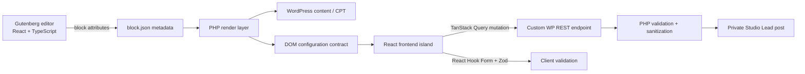

# Architecture

Studio Blocks is intentionally small, but it mirrors the integration pattern used in larger WordPress + React products.

## Service Grid

The editor UI is written in React/TypeScript. The block stores only presentation attributes such as heading, columns and item limit. The frontend is rendered by PHP and queries `studio_service` posts, so editors can manage content independently of the block implementation.

This demonstrates a common WordPress pattern: **React in the editor, PHP on the frontend**.

## Lead Form

The dynamic block renderer outputs translated copy plus a small DOM data contract containing the REST URL and button text. A React view script mounts into the generated root and handles the interactive form.

The frontend uses:

- React Hook Form for field state;
- Zod for typed validation;
- `@hookform/resolvers` to connect the schema to the form;
- TanStack Query for the submission mutation;
- WordPress i18n utilities for UI strings.

The REST controller validates and sanitizes the data again before creating a private `studio_lead` post. A honeypot and short anonymous transient rate limit demonstrate basic public-form hardening.

## Why both validation layers exist

Client-side validation improves UX, but it cannot be trusted for security. The PHP REST controller repeats critical validation because requests can bypass the browser application entirely.

## Accessibility decisions

- every visible field has a real `<label>`;
- validation messages are connected with `aria-describedby`;
- invalid fields set `aria-invalid`;
- submission feedback uses `role="status"` and `aria-live="polite"`;
- focus states remain visible;
- block markup uses semantic section/article structure.

## Internationalization

Both PHP and JavaScript strings use the `studio-blocks` text domain. The repository includes a starter POT file and keeps the block copy translation-ready instead of hard-coding locale-specific UI in the React components.
